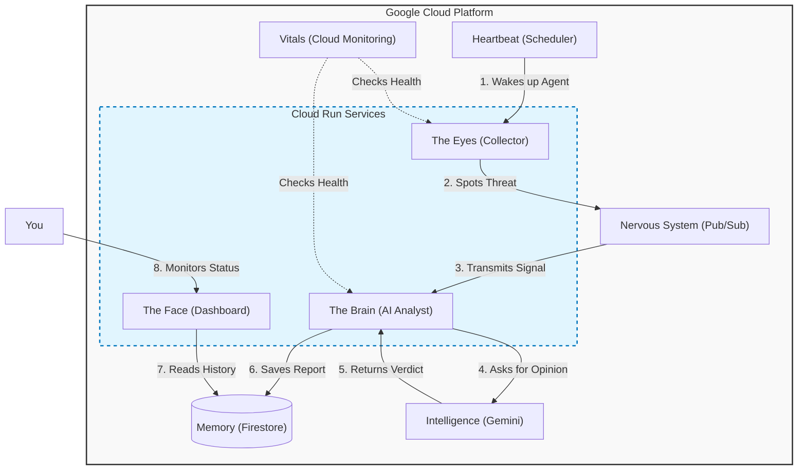

# Adaptive Threat Shadow (ATS)

<div align="center">
  
  <br/>
  <h3>A smart security system that doesn't just block threats—it understands them.</h3>
  <br/>
  <a href="https://ats-dashboard-pscn3qhgxq-uc.a.run.app/">
    
</div>

---

### 🚨 The Problem
Traditional security tools (SIEMs) are like **static checklists**: they look for exact matches of known bad guys. If a hacker changes one letter in their attack code, they slip past.

### 💡 The Solution
**Adaptive Threat Shadow** acts like a **digital analyst that never sleeps**. Instead of just matching patterns, it uses **Generative AI (Google Gemini)** to read raw data, understand the *context* of an attack, and decide how dangerous it is—just like a human expert would, but instantly and at scale.

| Feature | Traditional SIEM | Adaptive Threat Shadow |
| :--- | :--- | :--- |
| **Detection** | Pattern matching | Context understanding |
| **Alerting** | Rule-based alerts | AI reasoning |
| **Analysis** | Manual analysis | Automated intelligence |
| **Updates** | Static signatures | Dynamic threat assessment |
| **Cost** | Expensive licensing | Open Source + Serverless |

---

## What It Does

This is a fully automated, serverless pipeline that:
1.  **Simulates Attacks:** Generates realistic threat scenarios (Phishing, SQL Injection, Malware, Brute Force, Network Intrusion).
2.  **Thinks Critically:** Uses AI to reason through the data ("Is this just a failed login, or a brute-force attack?").
3.  **Assigns Risk Scores:** Calculates severity (0-100) based on context, not just keywords.
4.  **Recommends Actions:** Suggests specific remediation steps for each threat.
5.  **Visualizes Risk:** Displays a real-time "War Room" dashboard showing the heartbeat of your network's security.

### Adaptive Threat Shadow War Room
*Real-time visibility into AI-analyzed threat vectors.*


---

## Architecture (Under the Hood)

The system runs entirely on **Google Cloud Platform (GCP)**. Think of it like a biological system:

* **The Eyes (Collector):** A Python script that spots potential threats.
* **The Nervous System (Pub/Sub):** Rapidly transmits signals from the eyes to the brain.
* **The Brain (Vertex AI/Gemini):** Interprets the signal and decides if it's dangerous.
* **The Memory (Firestore):** Remembers every event for historical tracking.
* **The Face (Dashboard):** A clean interface for humans to see what's happening.
* **The Vitals (Cloud Monitoring):** Constant health checks that alert the admin if components fail or costs spike.



### Data Flow Example
> **Threat Detected:** SQL Injection Attempt `'; DROP TABLE users;--`
> 
> ↓ **Pub/Sub Message:** `{"type": "sql_injection", ...}`
> 
> ↓ **Gemini Analysis:** "Severe threat. Classic SQL injection attempting data destruction."
> 
> ↓ **Risk Score:** 98/100
> 
> ↓ **Action:** "Block IP, sanitize inputs, audit database permissions"
> 
> ↓ **Dashboard Update:** (< 5 seconds end-to-end)

---

## How It Works: The AI & Simulation Loop

This project is a self-contained "Cyber Range" that runs on a loop. Here is the step-by-step lifecycle of a threat event:

### 1. The Trigger (Simulation)
* **Infrastructure:** Cloud Scheduler
* **Logic:** Every hour, a cron job hits the Collector service's `/collect` endpoint.
* **Action:** The Collector executes a Python script that uses the `Faker` library to generate a realistic, random security log (e.g., *'Failed password for root from 192.168.1.50'*).

### 2. The Ingestion
* **Infrastructure:** Cloud Run (Collector) → Pub/Sub
* **Logic:** The Collector wraps this fake log into a JSON object and publishes it to the `osint-events-topic`.
* **Action:** This decouples ingestion from analysis, allowing the system to handle massive spikes in traffic without crashing.

### 3. The Analysis (Vertex AI Integration)
* **Infrastructure:** Cloud Run (Analyst) → Vertex AI (Gemini)
* **Logic:** The Analyst service subscribes to the topic. When it receives the log, it constructs a prompt: *"You remain a security expert. Analyze this log for intent and severity..."*
* **Security:** The service authenticates via IAM (`roles/aiplatform.user`), ensuring no API keys are ever hardcoded.
* **Action:** Gemini returns a structured JSON assessment, including a **Risk Score (0-100)** and **Remediation Steps**.

---

## System Internals
**The Heartbeat (Cloud Scheduler)** & **The Nervous System (Pub/Sub)**
 

**The Memory (Firestore)**


---

## Operational Guardrails

The system includes built-in "Self-Monitoring" to ensure reliability and prevent billing surprises: 

* **Collector Health:** Alerts if the ingestion service throws high error rates (5xx errors). 
* **Analyst Downtime:** Alerts if the AI processing service stops processing traffic entirely for >10 minutes. 
* **Dashboard Latency:** Warns if the UI takes >2 seconds to load, ensuring a good user experience. 
* **Cost Kill-Switch:** Critical alert if Firestore writes exceed safe limits, preventing infinite loop billing spikes.

---

## Tech Stack

| Component | Technology | Purpose |
| :--- | :--- | :--- |
| **Language** | Python 3.11 | Application logic |
| **IaC** | Terraform | Automated infrastructure |
| **Cloud** | Google Cloud Platform | Serverless compute & services |
| **AI** | Gemini 1.5 Pro (Vertex AI) | Threat analysis & reasoning |
| **Containers** | Docker + Cloud Run | Microservices deployment |
| **Database** | Firestore | NoSQL document storage |
| **Messaging** | Pub/Sub | Event-driven architecture |
| **Frontend** | Streamlit | Interactive dashboard |
| **Observability** | Cloud Monitoring & Logging | Alerting, error tracking & cost guardrails |

---

## How to Deploy (Quick Start)

### Prerequisites
* Google Cloud Account (Free tier works!)
* Terraform >= 1.0
* gcloud CLI & Docker installed

### 1️⃣ Clone the Repo
```bash
git clone [https://github.com/YOUR_USERNAME/adaptive-threat-shadow.git]
cd adaptive-threat-shadow
```

### 2️⃣ Create GCP Project
```bash
# Create and set project
gcloud projects create YOUR-PROJECT-ID
gcloud config set project YOUR-PROJECT-ID

# Link billing (required for APIs)
gcloud billing projects link YOUR-PROJECT-ID --billing-account=BILLING_ACCOUNT_ID
```

### 3️⃣ Deploy Infrastructure
```bash
cd infra/terraform

# Create backend bucket for state
# NOTE: Bucket names must be globally unique! Choose a unique name.
gsutil mb -p YOUR-PROJECT-ID -l us-central1 gs://YOUR-UNIQUE-STATE-BUCKET-NAME
[cite_start]gsutil versioning set on gs://YOUR-UNIQUE-STATE-BUCKET-NAME [cite: 11]

# Update backend.tf
# Open infra/terraform/backend.tf and replace "ats-terraform-state-bucket" 
# with your unique bucket name from above.

# Configure variables
cp terraform.tfvars.example terraform.tfvars
# Edit terraform.tfvars with your project_id AND alert_email
# IMPORTANT: You must add 'alert_email = "your-email@example.com"' 
# [cite_start]for the monitoring system to work! [cite: 1]

# Deploy
terraform init
terraform apply
```

### 4️⃣ Build & Deploy Services
```bash
# Authenticate Docker
gcloud auth configure-docker us-central1-docker.pkg.dev

# Build and push collector (repeat for 'analyst' and 'dashboard')
cd ../../src/collector
docker build -t us-central1-docker.pkg.dev/YOUR-PROJECT-ID/ats-repo/collector:latest .
docker push us-central1-docker.pkg.dev/YOUR-PROJECT-ID/ats-repo/collector:latest
```

### 5️⃣ Access Your Dashboard
```bash
terraform output dashboard_url
# Copy and paste the URL into your browser
```

---

## Cost Breakdown (Monthly Estimate)

| Service | Usage | Cost (Approx) |
| :--- | :--- | :--- |
| **Cloud Run** | ~100 requests/day | $5-10 |
| **Firestore** | ~3,000 writes/month | $0-5 |
| **Pub/Sub** | ~3,000 messages/month | $0-2 |
| **Scheduler** | 1 job, hourly | $0.10 |
| **Vertex AI** | ~100 API calls/day | $2-5 |
| **Monitoring**| Custom metrics & alerts | Free tier (usually) |
| **Total** | | **$7-22/month** |

> **💡 Pro Tip:** With default settings, personal usage usually stays within the GCP Free Tier limits!

---

## Roadmap

* ✅ **Phase 1: Core System** (Serverless architecture, AI analysis, Dashboard)
* ✅ **Phase 2: Reliability** (Remote State, Health Monitoring, Cost Alerting)
* **Phase 3: Enhanced Intelligence** (AbuseIPDB integration, Historical anomaly detection)
* **Phase 4: Automated Response** (Email alerts, Self-healing firewall rules)

---

## Security & Compliance

* **Zero Trust Architecture:** No implicit trust; verify everything.
* **Service Account Isolation:** Unique identities per service using Least Privilege.
* **OIDC Authentication:** Secure token-based service-to-service auth.
* **Network Segmentation:** Internal services (Analyst) are isolated from the public internet.
* **No Secrets:** No hardcoded credentials; uses Identity Tokens.

---

## Contributing

Contributions are welcome!
1.  Fork the repository.
2.  Create a feature branch (`git checkout -b feature/amazing-feature`).
3.  Commit your changes.
4.  Open a Pull Request.

---

<div align="center">
  <p>⚠️ <b>Disclaimer:</b> This project is for educational and demonstration purposes. Not recommended for production security monitoring without professional review.</p>
  <br />
  <h3> Built with ❤️ for the Security Community</h3>
  <p>Created by Dylan Droege - December 2025</p>
</div>
