# 🛡️ Adaptive Threat Shadow (ATS)


## A smart security system that doesn't just block threats—it understands them.

[](https://ats-dashboard-pscn3qhgxq-uc.a.run.app/)


### Adaptive Threat Shadow War Room
*Real-time visibility into AI-analyzed threat vectors.*


## 💡 The Concept: Why This Exists
Traditional security tools (SIEMs) are like **static checklists**: they look for exact matches of known bad guys. If a hacker changes one letter in their attack code, they slip past.

**Adaptive Threat Shadow** is different. It acts like a **digital analyst that never sleeps**. Instead of just matching patterns, it uses **Generative AI (Google Gemini)** to read raw data, understand the *context* of an attack, and decide how dangerous it is—just like a human expert would, but instantly and at scale.

## 📖 What It Does
This is a fully automated, serverless pipeline that:
1.  **Simulates Attacks:** Generates realistic threat scenarios (Phishing, SQL Injection, Malware).
2.  **Thinks Critically:** Uses AI to reason through the data ("Is this just a failed login, or a brute-force attack?").
3.  **Visualizes Risk:** Displays a real-time "War Room" dashboard showing the heartbeat of your network's security.

## 🏗️ Architecture (Under the Hood)
The system runs entirely on **Google Cloud Platform (GCP)**. Think of it like a biological system:

* **The Eyes (Collector):** A Python script that spots potential threats.
* **The Nervous System (Pub/Sub):** Rapidly transmits signals from the eyes to the brain.
* **The Brain (Vertex AI/Gemini):** Interprets the signal and decides if it's dangerous.
* **The Memory (Firestore):** Remembers every event for historical tracking.
* **The Face (Dashboard):** A clean interface for humans to see what's happening.

```mermaid
graph TD
    subgraph GCP [Google Cloud Platform]
        style GCP fill:#f9f9f9,stroke:#333,stroke-width:2px
        
        Scheduler["⏱️ Heartbeat (Scheduler)"]
        
        subgraph Microservices [Cloud Run Services]
            style Microservices fill:#e1f5fe,stroke:#0277bd,stroke-width:2px,stroke-dasharray: 5 5
            Collector["🐍 The Eyes (Collector)"]
            Analyst["🧠 The Brain (AI Analyst)"]
            Dashboard["📊 The Face (Dashboard)"]
        end
        
        PubSub["📨 Nervous System (Pub/Sub)"]
        Firestore[("🔥 Memory (Firestore)")]
        Vertex["✨ Intelligence (Gemini Pro)"]
    end

    User["👤 You"]

    %% Data Flow
    Scheduler -->|1. Wakes up Agent| Collector
    Collector -->|2. Spots Threat| PubSub
    PubSub -->|3. Transmits Signal| Analyst
    Analyst -->|4. Asks for Opinion| Vertex
    Vertex -->|5. Returns Verdict| Analyst
    Analyst -->|6. Saves Report| Firestore
    
    %% Dashboard Flow
    Dashboard -->|7. Reads History| Firestore
    User -->|8. Monitors Status| Dashboard
```


### 📸 System Internals (Evidence of Build)

| **The Heartbeat (Scheduler)** | **The Nervous System (Pub/Sub)** |
| :---: | :---: |
| Cloud Scheduler | Pub/Sub Metrics |
| *Cron job triggering the Collector hourly* | *Event flow velocity through the pipeline* |

| **The Memory (Firestore)** |
| :---: |
| Firestore Data |
| *Structured threat data enriched by Gemini* |

### 🧰 Tech Stack
* **Language:** Python 3.11
* **Infrastructure as Code:** Terraform (Everything is automated, no clicking in consoles)
* **Cloud Provider:** Google Cloud Platform (GCP)
* **AI Model:** Gemini 1.5 Pro via Vertex AI
* **Containerization:** Docker & Cloud Run

## ⚡ Key Features
* **It's "Alive":** The dashboard updates in real-time as the AI processes new threats.
* **Zero-Cost Idle:** Because it uses **Serverless** tech (Cloud Run), it costs $0.00 when no threats are being processed. It scales to zero automatically.
* **Security First:**
    * **Locked Doors:** Public access is blocked. Only the Scheduler can trigger the system.
    * **ID Badges:** Every service uses a specific "Service Account" with the least permissions needed to do its job.
    * **No Secrets:** No API keys are hardcoded. Everything uses secure Identity Tokens.

## 🚀 How to Deploy (Quick Start)
Want to run this yourself? You need a Google Cloud account.

1.  **Clone the Repo:**
    ```bash
    git clone [https://github.com/YOUR_USERNAME/adaptive-threat-shadow.git]
    cd adaptive-threat-shadow
    ```

2.  **Deploy Infrastructure (The "Magic" Step):**
    This uses Terraform to build the entire cloud environment for you.
    ```bash
    cd infra/terraform
    terraform init
    terraform apply -var="project_id=YOUR_PROJECT_ID"
    ```

3.  **Watch it Work:**
    Terraform will output your Dashboard URL at the end. Click it to see the system live.

## 🔮 Roadmap
* [ ] **Real-World Feeds:** Connect to live threat feeds like AbuseIPDB.
* [ ] **Email Alerts:** Add SendGrid to email me when the Risk Score hits 90+.
* [ ] **Self-Healing:** Allow the AI to automatically block IPs in the firewall.

## 🔐 Security Note
This project adheres to **Zero Trust** principles.
* **Ingress Lockdown:** The `Collector` and `Analyst` services are not accessible from the public internet.
* **Authentication:** All internal communication is secured via OIDC (OpenID Connect) tokens.

## 🙌 Acknowledgements & Resources
Special thanks to the open-source community and the tools that made this possible:

* **[Streamlit](https://streamlit.io/):** For making Python data apps beautiful and easy.
* **[Google Cloud Platform](https://cloud.google.com/):** For the robust free tier that powers this project.
* **[Terraform](https://www.terraform.io/):** For making infrastructure reproducible.
* **[Mermaid.js](https://mermaid.js.org/):** For the diagrams in this README.
* **Google Gemini:** For providing the reasoning engine behind the analysis.

---
*Created by Dylan Droege - DEC2025*